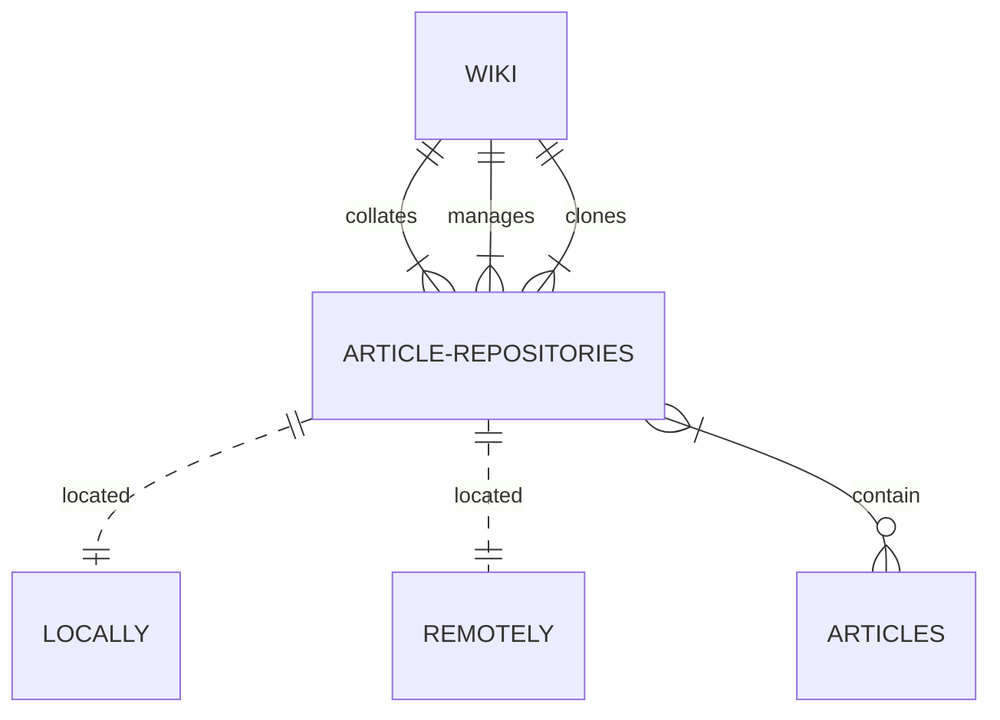
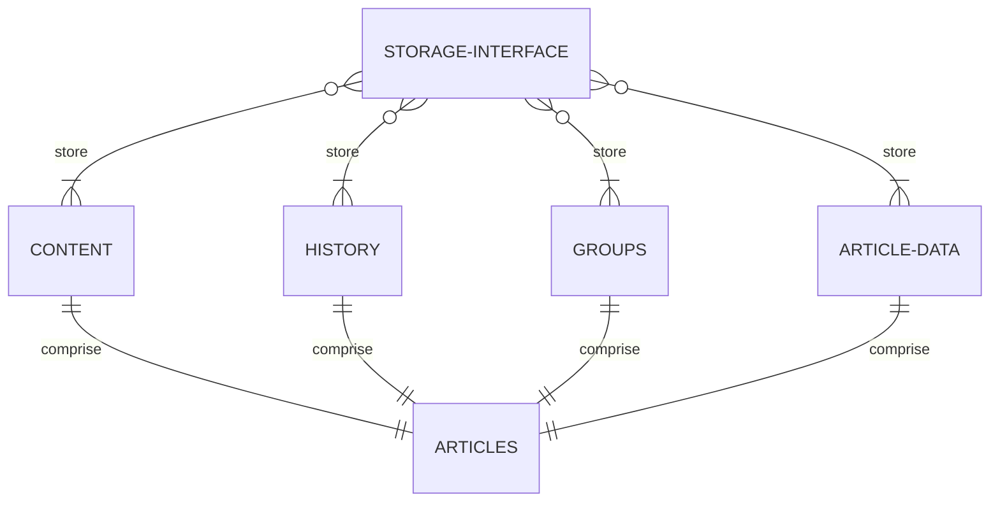

# Sigili

> A library to create a Distributed Wiki.

You're looking at the workhorse library that makes the whole thing work.

If you wanna use it for your own project, install it with `pip install sigili`

## Users and Editors

High-level view, a User uses an editor to manage a wiki. The editor includes drafting tools, wiki management tools, and the things necessary for a distributed service to work like remote repository management.

An editor can be anything that can talk to a wiki. Check out sigili-cli if you'd like to use something familiar to git. Check out roughdrafts.xyz if you'd like to see a web host for it.

## Wikis and Articles

A wiki is just a library that manages and collates article repositories. You can find this in sigili/wiki.py

## Articles and their services

An article repository receives commands from a wiki, and then manages everything from there. This is just instructing different services on top of storage interfaces. You can see the repository types and their services in sigili/article/

## Examples of Storage Interfaces

A storage interface can be a large number of things - If it can be written and read from, it can be used as a storage interface. An Article Repository's services can all be connected to different storage interfaces as well.

Interaction with a storage interface is implemented via the services located in sigili/article.

## What does Sigili mean?

I wanted to use the name Sigil, but a popular library on pypi already uses that. Sigili is the plural of Sigil. It also means a few things in different languages.
