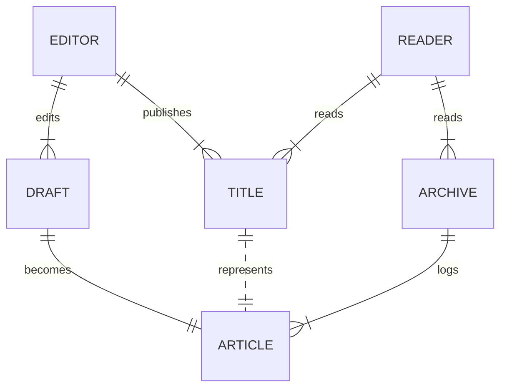
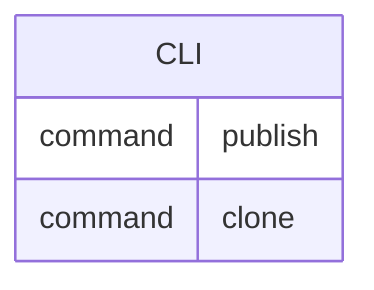

## Readers and Editors

```mermaid
erDiagram
EDITOR||--|{DRAFT:"edits"
EDITOR||--|{TITLE:"publishes"
DRAFT||--||ARTICLE:"becomes"
ARCHIVE||--|{ARTICLE:"logs"
READER||--|{TITLE:"reads"
TITLE||..||ARTICLE:"represents"
READER||--|{ARCHIVE:"reads"
```

### What makes use of this?

```mermaid
erDiagram
CLI{
    command publish
    command clone
}
```
